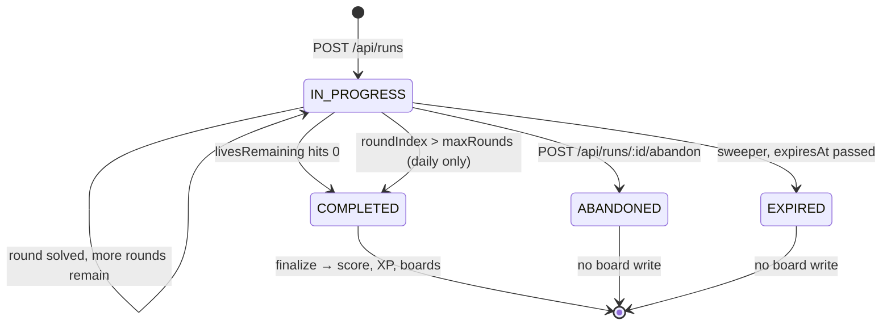
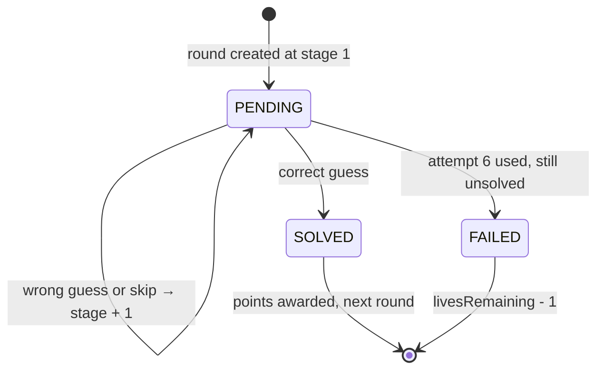

# Game engine — run/round state machine

Companion to [`prisma/schema.prisma`](../prisma/schema.prisma). One engine serves
every game and every mode; a game is configuration, a mode is a flag on `Run`.

## Vocabulary

| Term | Meaning |
| --- | --- |
| **Puzzle** | One thing to guess. For songless, one song. |
| **Reveal stage** | How much of the puzzle is unlocked. Stage 1 = 0.2s, stage 6 = 7s. Cumulative. |
| **Attempt** | A guess or a skip. Both advance the stage. 6 per puzzle. |
| **Round** | One puzzle inside a run. |
| **Run** | One sitting. Daily = 20 rounds, 3 lives. Practice/endless = unbounded, 3 lives. |
| **Tier** | Easy / Medium / Hard. Changes *which songs*, never the ladder. |

The ladder, attempt count, and answer format are **identical across all tiers**.
Difficulty comes from two places only: which slice of the catalog is sampled
(`GameTier.startPopularity` + `rampPerRound`), and where in the track the clip
starts (`Song.hookStartMs`).

## Run lifecycle



`COMPLETED` is the only terminal state that writes to a leaderboard. A daily run
that runs out of lives at round 7 still completes — it just scores less. Quitting
mid-run is `ABANDONED` and scores nothing, which is what stops daily players from
rerolling a bad start.

## Round lifecycle



## Transitions

Every row is one server transaction over a row-locked `Run`.

| Action | Guard | Effect |
| --- | --- | --- |
| `startRun` | tier unlocked for player level; for `DAILY`, no existing run for `(player, game, tier, dayKey)` | create `Run`, create round 1, return stage-1 asset URL + run token |
| `guess` (correct) | run `IN_PROGRESS`, round `PENDING`, `attemptsUsed < maxAttempts`, idempotency key unused | round → `SOLVED`, award points/XP, `currentStreak++`, advance cursor or finalize |
| `guess` (wrong) | same | `attemptsUsed++`; if `< maxAttempts` → `stageReached++`, return next asset; else round → `FAILED` |
| `skip` | same | identical to a wrong guess, recorded with `isSkip = true` |
| round → `FAILED` | — | `livesRemaining--`, `currentStreak = 0`; if lives 0 → finalize run |
| `abandon` | run `IN_PROGRESS` | run → `ABANDONED`, `endedAt` set, no board write |
| sweeper | `expiresAt < now()`, still `IN_PROGRESS` | run → `EXPIRED` |

**Correct guess on the last attempt still solves.** Attempt 6 is a real attempt at
stage 6, not a formality.

## Server authority — the non-negotiables

1. **The client never learns the answer of a `PENDING` round.** No `puzzleId`, no
   title, no artist in any response until `outcome != PENDING`. The typeahead is
   backed by a catalog-wide search endpoint that has no idea what the current
   round is.
2. **Asset URLs are issued one stage at a time**, signed, TTL ~60s, scoped to the
   run. `PuzzleAsset.storageKey` is never public and clips are cumulative, so a
   scrubbable full track never reaches the browser.
3. **The client does not send `roundIndex`.** `guess` and `skip` act on
   `Run.currentRoundIndex`. Old rounds are unreachable by construction.
4. **The client does not send stage, attempt number, or score.** All derived from
   `RunRound` + `Guess` rows.
5. **Idempotency.** Every attempt carries a client-generated key, unique on
   `Guess.idempotencyKey`. A retried request returns the stored result instead of
   burning a second attempt. `@@unique([roundId, attemptIndex])` is the backstop
   if a key is ever omitted.
6. **Row lock, not read-then-write.** `SELECT … FOR UPDATE` on the `Run` inside
   the transaction, with `Run.version` incremented as a second guard. Two
   simultaneous submits cannot both advance the ladder.
7. **Run token** on every mutation: raw token in an `Authorization` header,
   compared against `Run.tokenHash`. Owning a player cookie is not enough to
   mutate someone else's run.

## API surface

Next 16 route handlers. `params` is a Promise and `cookies()` / `headers()` are
async — see `node_modules/next/dist/docs/01-app/03-api-reference/03-file-conventions/route.md`.

```
POST   /api/runs                      → start a run   { gameSlug, mode, tier }
GET    /api/runs/[runId]              → resume: current round, stage, asset URL
POST   /api/runs/[runId]/guess        → { guessedPuzzleId, idempotencyKey }
POST   /api/runs/[runId]/skip         → { idempotencyKey }
POST   /api/runs/[runId]/abandon
GET    /api/games/[slug]/search       → typeahead over the catalog
GET    /api/games/[slug]/leaderboard  → ?board=DAILY&tier=EASY&period=2026-08-19
POST   /api/players/claim             → guest → user merge
```

Typed context via the global `RouteContext` helper:

```ts
export async function POST(request: Request, ctx: RouteContext<'/api/runs/[runId]'>) {
  const { runId } = await ctx.params
  // …
}
```

Attempt responses are one shape, whether the guess was right or wrong:

```ts
type AttemptResult = {
  outcome: 'PENDING' | 'SOLVED' | 'FAILED'
  stageReached: number
  attemptsUsed: number
  attemptsRemaining: number
  nextAssetUrl: string | null      // null once the round resolves
  livesRemaining: number
  runStatus: RunStatus
  points: number | null            // null while PENDING
  reveal: { title: string; artist: string; artworkUrl: string } | null  // only when resolved
}
```

## Scoring

Formula lives in code (`src/lib/game/scoring/v1.ts`), pinned per run by
`Run.scoringVersion`, so rebalancing never rewrites old scores.

```
stageBase   = [1000, 800, 600, 400, 250, 100][stageReached - 1]
tierMult    = GameTier.scoreMultiplier          // 1.0 / 1.4 / 1.9
depthBonus  = 1 + 0.03 * (roundIndex - 1)
streakBonus = 1 + min(0.10 * currentStreak, 0.50)   // first-stage solves only

points = round(stageBase * tierMult * depthBonus * streakBonus)
xp     = round((10 + 4 * (maxAttempts - attemptsUsed)) * tierMult)
```

A failed round scores 0 points and 0 XP. XP is deliberately flatter than score —
score is spiky and competitive, XP should feel like steady progress. They are
separate columns; never derive one from the other at read time.

## Puzzle selection

```
targetPopularity = clamp(
  tier.startPopularity - tier.rampPerRound * (roundIndex - 1),
  tier.minPopularity,
  100
)
```

Sample one active, unblocked puzzle within `±tier.sampleWindow` of the target,
excluding:

- puzzles already in this run (`@@unique([runId, puzzleId])` is the hard stop)
- puzzles in `PlayerPuzzleHistory` newer than `Game.puzzleCooldownDays`

Widen the window progressively if the pool comes back empty; log when it does,
because that's your signal the catalog is too thin at that percentile.

Both `targetPopularity` and the sampled `puzzlePopularity` are stored on
`RunRound` so the difficulty curve can be audited later without replaying runs.

## Difficulty self-tuning

`Puzzle.popularity` starts as `seedPopularity` from an external signal. After
~200 plays, recompute from telemetry:

```
earlySolveRate = earlySolveCount / playCount    // solved within first 3 stages
```

Map `earlySolveRate` back onto a percentile and blend toward it rather than
jumping, so one bad week of traffic can't reshuffle the catalog. `seedPopularity`
stays untouched so any retune is reversible.

## Daily challenge

- `dayKey` is a calendar date in one fixed platform timezone (`DAILY_TZ`, e.g.
  `Asia/Kolkata`). Pick it once and never make it per-user — a per-user day means
  no two players share a puzzle set, which defeats the entire point.
- A cron job generates tomorrow's `DailyChallenge` per tier and freezes the
  ordered puzzle list. Generate at least a day ahead so a failed job is
  recoverable before anyone notices.
- One-per-day is enforced by the database, not by application logic:
  `@@unique([playerId, gameId, tier, dayKey])` on `Run`. Because Postgres treats
  `NULL`s as distinct in unique indexes, practice and endless runs — which leave
  `dayKey` null — are unaffected and unlimited. No partial index required.

## Guest → user claim

1. First request mints a `Player` with `kind = GUEST`; id goes into a signed
   `httpOnly` cookie, mirrored to `localStorage` for recovery.
2. Guests play and rank normally. XP and coins accrue on the guest row.
3. At signup, in one transaction: insert `GuestClaim` (unique on
   `guestPlayerId`), repoint `Run` / `PlayerGameStat` / `PlayerPuzzleHistory` /
   `LeaderboardEntry` to the user row, write a `GUEST_MERGE` ledger entry.
4. The unique on `guestPlayerId` makes the whole thing idempotent and one-way —
   a replayed claim request fails the insert and rolls back cleanly.

Surface the prompt immediately after a strong run, never before: *"That run puts
you #14 this week — create an account to keep it."*

## Board writes

On finalize, upsert `LeaderboardEntry` for each applicable board. Only ranked
runs (`Run.isRanked`) write; practice never does.

| Board | periodKey | Score source |
| --- | --- | --- |
| `DAILY` | `2026-08-19` | that daily run's score |
| `WEEKLY_BEST_RUN` | `2026-W34` | best single run in the ISO week |
| `ALLTIME_BEST_RUN` | `ALL` | best single run ever |
| `ALLTIME_XP` | `ALL` | `PlayerGameStat.xp` |
| `DAILY_STREAK` | `ALL` | `currentDailyStreak` |

Upsert keeps the better row: `score DESC`, then `tieBreakRevealMs ASC`, then
`tieBreakDurationMs ASC`. `rank` is computed on read (window function) and cached
for display — never treated as truth.

## v1 scope

**Ship:** `DAILY` + `PRACTICE`, three tiers, today's board per tier, guest play,
server-authoritative rounds, cumulative clips on CDN, XP/level, share card.

**Schema present but unwired:** `ENDLESS`, `HintUsage`, coins, streak freezes,
weekly/all-time boards.

**Enabling endless later** is a `GameTier` row plus flipping `mode` — the run
loop, selection, scoring, and boards already handle unbounded runs
(`maxRounds = null`). That's the whole reason to keep the engine mode-agnostic
now, even though v1 only ships daily.

## Prisma 7 setup notes

The schema is written for Prisma 7, which differs from most examples online:

- The generator is `prisma-client`, **not** `prisma-client-js`, and `output` is
  required. Ours generates to `src/generated/prisma` (gitignored), so imports are
  `from '@/generated/prisma/client'` rather than `from '@prisma/client'`.
- `datasource` carries **no `url`**. The connection string lives in
  [`prisma.config.ts`](../prisma.config.ts).
- `PrismaClient` must be constructed with a **driver adapter**; there is no
  built-in engine connection anymore.
- `prisma migrate diff` uses `--to-schema`, not the old `--to-schema-datamodel`.

```bash
npm i @prisma/client @prisma/adapter-pg && npm i -D prisma dotenv
```

```ts
// src/lib/db.ts
import { PrismaPg } from '@prisma/adapter-pg'
import { PrismaClient } from '@/generated/prisma/client'

const adapter = new PrismaPg({ connectionString: process.env.DATABASE_URL! })

// Reuse across dev hot reloads so we don't exhaust the connection pool.
const globalForPrisma = globalThis as unknown as { prisma?: PrismaClient }
export const prisma = globalForPrisma.prisma ?? new PrismaClient({ adapter })
if (process.env.NODE_ENV !== 'production') globalForPrisma.prisma = prisma
```

Two things the schema deliberately leaves to a raw migration:

- **Trigram search** for the typeahead: `CREATE EXTENSION pg_trgm` plus a GIN
  index on `Song.searchText`. The btree index in the schema is a placeholder.
- **`PlayerPuzzleHistory` cleanup**: a periodic delete past
  `Game.puzzleCooldownDays`, or partitioning if it grows.

Verified against Prisma 7.9.1: schema validates, client generates, and the
initial migration produces 17 tables with all three integrity constraints intact
(`Run_playerId_gameId_tier_dayKey_key`, `Guess_roundId_attemptIndex_key`,
`RunRound_runId_puzzleId_key`).
